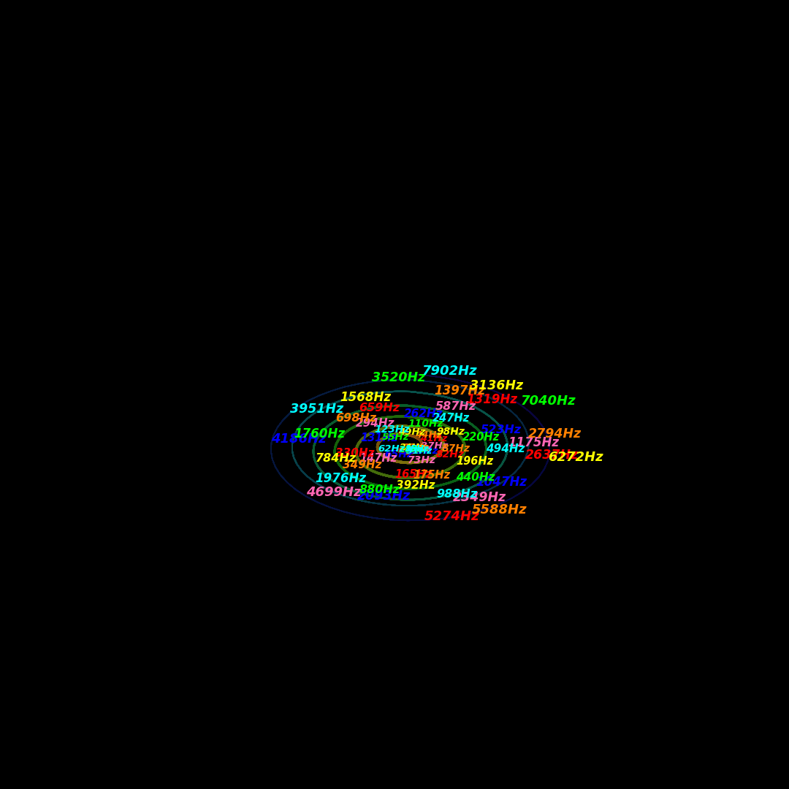

# SYNESTHESIA 2.0

**AI-Enhanced Psychoacoustic Visualization**

Transform audio into stunning 3D cochlear spiral visualizations with deep learning classification overlays.



## Overview

SYNESTHESIA 2.0 is a complete Python port and enhancement of the original MATLAB visualization system that has generated over 1 million views on YouTube. This version adds:

- **Python-native pipeline** - No MATLAB license required
- **AI Classification Overlay** - Real-time instrument detection using Vision Transformers
- **Attention Visualization** - See which parts of the spiral drive classification decisions
- **GPU Acceleration** - CuPy support for faster analysis
- **Web Interface** - Coming in Phase 4

## Quick Start

```bash
# Install dependencies
pip install -r requirements.txt

# Generate a test frame
python spiral_renderer.py

# Generate demo video with synthetic audio
python synesthesia_cli.py --demo -o demo.mp4

# Process your own audio file
python synesthesia_cli.py input.wav -o output.mp4
```

## Architecture

```
Audio File (.wav/.mp3)
       │
       ▼
┌─────────────────────────────────┐
│     AudioAnalyzer               │
│   • FFT frequency extraction    │
│   • 381 frequency bins          │
│   • Amplitude & phase data      │
│   • ISO 226 loudness curves     │
└─────────────────────────────────┘
       │
       ▼
┌─────────────────────────────────┐
│     SpiralTubeRenderer          │
│   • 3D cochlear spiral mesh     │
│   • Radial wave animation       │
│   • HSV chromesthesia colors    │
│   • Solfège note labels         │
│   • Dynamic camera motion       │
└─────────────────────────────────┘
       │
       ▼
┌─────────────────────────────────┐
│     AIOverlayClassifier         │
│   • ViT instrument detection    │
│   • Attention map extraction    │
│   • Confidence visualization    │
│   • Temporal smoothing          │
└─────────────────────────────────┘
       │
       ▼
┌─────────────────────────────────┐
│     VideoGenerator              │
│   • Frame-by-frame rendering    │
│   • FFmpeg H.264 encoding       │
│   • 1080p/4K output             │
│   • Audio synchronization       │
└─────────────────────────────────┘
       │
       ▼
   Output Video (.mp4/.mov)
```

## Files

| File | Description |
|------|-------------|
| `audio_analyzer.py` | FFT analysis, ported from `record15_LEF.m` |
| `spiral_renderer.py` | 3D visualization, ported from `piperecord11_LEF.m` |
| `video_generator.py` | Complete pipeline with FFmpeg integration |
| `ai_overlay.py` | Vision Transformer classification & attention |
| `synesthesia_cli.py` | Command-line interface |
| `requirements.txt` | Python dependencies |

## Command Line Usage

```bash
# Basic usage
python synesthesia_cli.py song.wav -o visualization.mp4

# 4K output
python synesthesia_cli.py song.mp3 -o output.mp4 --4k

# Extract 60 seconds starting at 30s
python synesthesia_cli.py song.wav -o clip.mp4 --start 30 --duration 60

# With AI overlay (requires trained model)
python synesthesia_cli.py song.wav -o output.mp4 --ai-overlay --instrument-model model.pt

# Generate single test frame
python synesthesia_cli.py --test-frame -o test.png

# Demo with synthetic audio
python synesthesia_cli.py --demo -o demo.mp4 --demo-duration 15
```

## Python API

```python
from synesthesia2 import VideoGenerator, VideoConfig

# Configure output
config = VideoConfig(
    output_width=1920,
    output_height=1080,
    frame_rate=60,
    video_crf=18,  # Quality (lower = better)
    enable_ai_overlay=True
)

# Generate video
generator = VideoGenerator(video_config=config)
generator.generate(
    audio_path="song.wav",
    output_path="visualization.mp4",
    start_time=0,
    duration=None  # Full song
)
```

## Chromesthesia Color Mapping

The visualization uses a chromesthesia-inspired color mapping:

| Note | Solfège | Color |
|------|---------|-------|
| A | Do | Blue |
| B | Re | Pink |
| C | Mi | Red |
| D | Fa | Orange |
| E | Sol | Yellow |
| F | La | Green |
| G | Si | Cyan |

## Technical Details

### Spiral Geometry
- **Fermat spiral** - r = θ (linear increase with angle)
- **Golden Ratio (φ)** - Used in draft calculations for smooth tube shape
- **7 turns** - Covers 7 octaves of frequency

### Audio Analysis
- **381 frequency bins** - Logarithmically spaced from 20Hz to 8kHz
- **60 fps** - Frame rate matching the visualization
- **ISO 226 compensation** - Equal-loudness contours for perceptual accuracy

### AI Classification (Phase 2)
- **Vision Transformer (ViT-B/16)** - Pretrained on ImageNet, fine-tuned on spiral frames
- **Attention Rollout** - Visualizes which frequency regions influence classification
- **Temporal Smoothing** - 10-frame window for stable predictions

## Requirements

- Python 3.8+
- FFmpeg (for video encoding)
- 4GB+ RAM
- NVIDIA GPU (optional, for faster analysis)

## Coming Soon (Phase 3-4)

- **Learnable Visualization Parameters** - Neural network optimizes colors and shapes
- **Web Interface** - Drag-and-drop video generation
- **YouTube Integration** - Direct upload with auto-generated descriptions
- **Real-time Preview** - See visualization while audio plays

## Credits

Based on the original SYNESTHESIA MATLAB system by Niv Dvir.

YouTube: [@NivDvir-ND](https://youtube.com/@NivDvir-ND)

## License

MIT License - See LICENSE file for details.
